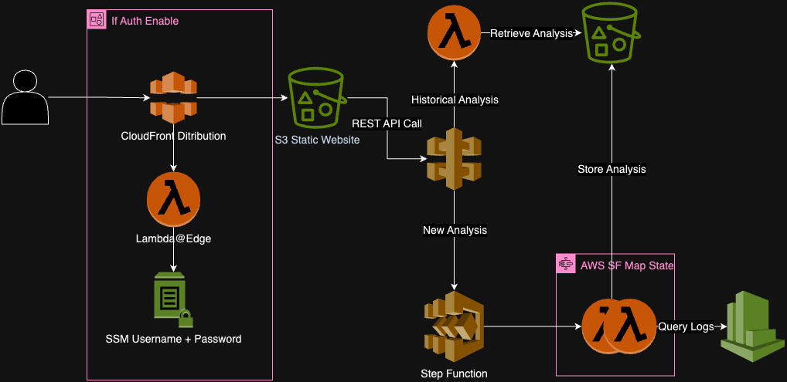

# Lambda Cost Analysis

This project provides an automated way to analyze AWS Lambda function costs and detect issues. Key features
include:

- **Detect Over-Provisioned, Under-Provisioned, and Timing Out Lambdas**
- **Perform Cost Analysis with Estimated Savings**
- **Filter Analysis to Run Only on Specific Lambda Functions** Based on Runtime and Package Type
- **Set Start and End Dates for Analysis** and **Consult Historical Results**

## Limitations

- **Analysis Runs on the Current Lambda Configuration**: If a function's memory or CPU type changes between the start
  and end dates, the historical analysis won't reflect those changes.
- **Incurs Log Scanning Costs**: AWS charges **$0.005 per GB of data scanned**. Use the tool wisely to minimize costs.
- **Analysis Only Includes Existing Lambda Functions**: Deleted functions are not analyzed.


## Why This Project?

Managing multiple AWS Lambda functions can be exhausting, especially when optimizing memory and cost. While projects
like [AWS Lambda Power Tuning](https://github.com/alexcasalboni/aws-lambda-power-tuning) exist, I have faced some limitations using them:

- **Manual Effort for Large-Scale Lambda Optimization**: Running individual analyses for each function and selecting the
  right payload can be time-consuming.
- **Payload-Dependent Memory Usage**: If a function's memory usage varies with payload size, multiple test runs are
  needed to determine the optimal configuration.

This project serves as a **shortcut to quickly detect issues across all deployed Lambda functions**, helping cloud engineers
identify inefficiencies without running detailed tuning tests for each function. It is **not** a comprehensive
cost-management tool such as **AWS Lambda Insights, tag-based cost allocation, and Lambda Power Tuning** to
optimize serverless deployments.
---

## Architecture



---

## Deployment Commands

To get started with deploying and managing your CDK stack, follow these steps:

1. **Install Frontend Dependencies and Build**

   Navigate to the frontend directory and install the required dependencies. Then, build the frontend:

   ```bash
   cd frontend
   npm install
   npm run build
   ```
2. **Install AWS CDK CLI**

   Ensure that the AWS CDK CLI is installed. You can install it globally using npm:

   ```bash
   npm install -g aws-cdk@2
   ```

3. **Install CDK Dependencies**

   Navigate to the infrastructure directory and install the required dependencies:

   ```bash
   npm install 
   ```

4. **Bootstrap the Target Region and us-east-1 for Lambda @Edge**:

   Run the following commands to bootstrap both the target region and `us-east-1` (Lambda @Edge region) in case you need
   to include authentication:

   ```bash
   cdk bootstrap aws://YOUR_ACCOUNT_ID/TARGET_REGION

   cdk bootstrap aws://YOUR_ACCOUNT_ID/us-east-1
   ```
   
5. **Deploy the Stack**:

   To deploy the entire stack, use the following command:

   ```bash
   npm run deploy --all
   ```

   If you want to deploy with basic auth, run the deployment with the following command, replacing `testUsername` and
   `testPassword` with your desired username and password:

   ```bash
   npm run deploy -c auth=true -c username=testUsername -c password=testPassword
   ```

### Parameters

| Parameter  | Type   | Description                                    | Mandatory                       |
|------------|--------|------------------------------------------------|---------------------------------|
| `auth`     | String | Enable or disable basic auth (`True`/`False`). | Yes                             |
| `username` | String | Username for basic auth.                       | Yes, if `auth` is set to `True` |
| `password` | String | Password for basic auth.                       | Yes, if `auth` is set to `True` |

### Retrieving & Update Username and Password

If you forget the username or password, you can retrieve them by navigating to the AWS Management Console and checking
the SSM Parameters /lambda-analytics/username & /lambda-analytics/password

## Roadmap

Future improvements include:

- **Multi-Region Analysis**
- **Include Cloudwatch Query Cost for each Analysis**
- **Cost Analysis for Other Serverless Services** (e.g., DynamoDB, S3)
- **Multi-Account Analysis**
